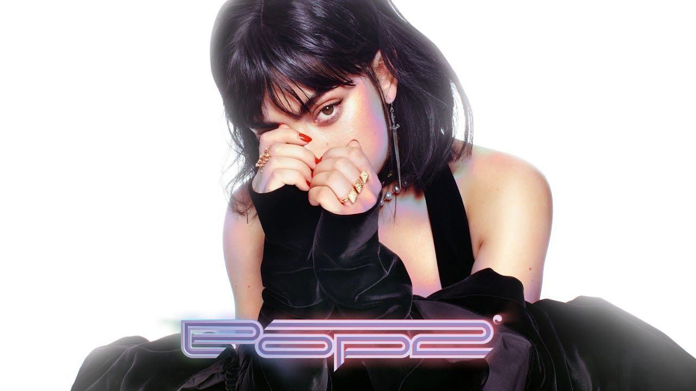

For the world at large, the year 2000 brought promise, yet equally, fear. Whilst many saw the new millennium as a fresh beginning, many were convinced that it would be the end of technology itself, with a supposed computer-related apocalypse looming on the horizon. But some took a different, more positive stance, believing in a technological future full of unlimited prosperity, allowing a sense of newfound optimism to emerge. 

Through this optimism emerged the Y2K (year two-thousand) aesthetic, a visual direction that looked to the future with awe, envisioning a world full of sleekness, modernity and futurism. Whilst the impact of the Y2K aesthetic upon design as a whole is known to be great, the considerable impact it has had upon the typographical realm is often ignored. 

## Y2K and the Typographical Realm

Sleek designs were one of the key goals of the Y2K aesthetic, reflected heavily within architecture; curves and spherical features were admired and seen as a sign of modernity and clarity. The same applied to typography, bubble-like and curved fonts became all the rage making a permanent impact upon popular culture. It only takes a brief look at popular products to see where this influence remains. The PS4, for example, is recognisable by its sleek, curved logo that stems back to the year 2000, upon the release of the PS2. Slight changes have been made, from a more robotic, rigid look for the PS2, to a more flexible curved logo for the PS4, but overall the core of the logo has remained largely, the same. Here we have an example of a style that has stood the test of time. Despite the fact that two decades have passed since then, the futuristic element of the font still speaks to both consumers and creators. Y2K inspired Futurism will always have a place in forward-thinking companies, especially those within such a technological field as the video-game industry.

However, much of the credit for this sleek-inspired typography should be given to the Sheffield-based design company, “Designer’s Republic”. Through their work on the "Wipeout" video game series and various different album artworks, they popularised sleek, futuristic fonts and made them commonplace within pop culture. Colours within this distinct typography were usually very similar, often using an ice blue colour palette. As the Y2K tailored company Future Memory explained the Y2K aesthetic's ice blue palette “evoked the coolness of the y2k era's new digital world in contrast with analogue warmth.” 

Texture within typography as a whole also became increasingly important, with various different types of styles becoming popular. The idea of “liquid-like” textures within typography became rather popular and evoked the feeling of formlessness. This sense of design was present across a variety of media, but perhaps one of the more recognisable examples was the "BlueRush" brand of perfume. This was another theme Future Memory identified, stating that “The digital or virtual "ocean" was a popular motif, evoking the formlessness and adaptability of the web and digital communication - it was natural that water-inspired colours followed.” Chrome-like aesthetics within typography also arose for similar reasons and were simply used to easily convey the sense of sleekness and elegance that are commonly linked to futurism, already established through the likes of sci-fi films.

Despite a brief loss of popularity, the influence of Y2K aesthetics on typography is still ever-growing. It was only logical that with the resurgence of early 2000s fashion and music, elements of this futuristic movement would too. Artists such as SOPHIE, Charli XCX, A. J. Cook, Hannah Diamond and many others, attempt to replicate the Y2K aesthetic not only through their sonic styles but also through their album covers and promotional material. Suddenly, this sense of design has managed to seep its way into mainstream pop culture, in a less subtle way. While it was understandably ever-present in the technological realm, the music industry seemed to have left these aesthetics behind, until suddenly they returned. 

Perhaps this unexpected resurgence derives from the dire need for optimism that futurism entails, especially in a world that is often rife with pessimism. Whatever theory one chooses, it is clear to see that the influence of the early 2000s on typography never *really* stopped, and there is no reason to assume that this train of design will be slowing down anytime soon. In a post-pandemic world, perhaps futuristic optimism is what we need, even in subtle details such as typography and design, its presence is surely appreciated.